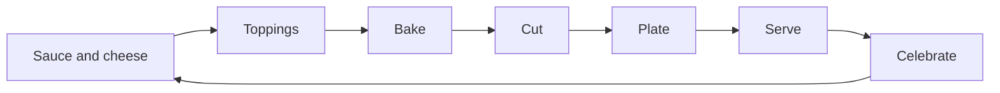

# Pizza Party — Requirements

2026-09-16 · Phil

## Overview and goals

Pizza Party is a 3D pizza-making toy for a three-year-old: add toppings, bake, cut, plate, serve, repeat. It runs on Meta Quest 3, tablets and phones from one codebase. "Pizza Party" is a working title.

It is a toy, not a game with rules. There is no way to lose, no timer pressure, no score, and no reading required.

Success looks like:

- The child completes a full pizza with no adult help after one demonstration.
- A full loop takes 2–4 minutes, and the child chooses to start another.
- The same build is playable on Quest 3, a tablet and a phone with no platform-specific content.

## Player and design principles

The player is a pre-reader with developing fine motor control and a short attention span. A parent is nearby but should not need to help.

- **P1. No fail states.** Every action produces a positive result. A pizza can be silly, never wrong.
- **P2. No text.** All guidance is visual and audio: glowing targets, a pointing hand, spoken prompts.
- **P3. Forgiving input.** Large hit targets (at least 15 mm on touch), generous snap zones, and drops that miss still land somewhere sensible.
- **P4. One thing at a time.** Each stage shows only the objects it needs. Stage changes are triggered by one big obvious action.
- **P5. Immediate feedback.** Every touch gets a sound and a visual response within 100 ms.
- **P6. No waiting.** Nothing takes more than about 5 seconds without something to watch or do.
- **P7. Child-led pacing.** No timers and no nagging. After 10 seconds idle, a gentle hint animates.
- **P8. Short sessions.** The loop has a natural end point so a parent can say "one more pizza".

## Core gameplay loop

One pizza moves through six stages, then a customer reacts and the loop restarts.

The pizza starts as plain dough on the counter. The child spreads the sauce and cheese before adding toppings.

### Stage 0: Sauce and cheese

- G0.1 A chunky sauce squeeze bottle sits beside the dough. Dragging the bottle over the dough tilts it and squirts sauce, painting wherever it passes.
- G0.2 Any scribble works. Once about 60% of the dough is covered, the sauce spreads to fill the rest with a satisfying swirl.
- G0.3 Sauce cannot go outside the crust. Strokes off the pizza do nothing.
- G0.4 When sauce is done, the bottle hops away and a cheese bowl appears. Only one tool is active at a time.
- G0.5 Dragging from the cheese bowl over the pizza sprinkles cheese along the path. Same 60% auto-fill rule.
- G0.6 Each has its own sound: a wet "splat" for sauce, a soft sprinkle for cheese.
- G0.7 When cheese is done, the topping bowls slide in and Stage 1 begins. No "done" button is needed for this stage.
- G0.8 Sauce and cheese are painted into a mask texture on the pizza, not spawned as objects, to protect performance.

### Stage 1: Toppings

- G1.1 Show 5–6 topping bowls around the pizza (for example tomato, pepperoni, mushroom, pepper, olive, pineapple), arranged around the pizza rather than in one row.
- G1.2 Dragging from a bowl spawns one topping piece. Bowls never run out.
- G1.3 A piece dropped over the pizza lands on its surface with a small bounce and a "plop".
- G1.4 A piece dropped off the pizza hops back to its bowl. Nothing is lost or left on the floor.
- G1.5 No minimum or maximum toppings. A soft cap of about 40 pieces protects performance; past it, the oldest piece is silently merged.
- G1.6 A large "done" object (an oven mitt or bell) moves to the next stage. It starts to glow after the first topping.

### Stage 2: Bake

- G2.1 The child drags or pushes the pizza into the oven. The oven mouth has a wide snap zone.
- G2.2 The door closes on its own. Baking takes 5–8 seconds.
- G2.3 During baking the oven window shows cheese bubbling and crust browning, with a ticking sound and a "ding" at the end.
- G2.4 The pizza cannot burn. There is no timing challenge.
- G2.5 The door opens on the ding and the pizza slides out, or the child pulls it out. Steam and a visible baked look confirm the change.

### Stage 3: Cut

- G3.1 A pizza wheel appears. Glowing guide lines show where to cut.
- G3.2 Any swipe or wheel pass roughly near a guide line counts and snaps to a clean cut.
- G3.3 Default is 2 cuts giving 4 slices. A parent setting allows 3 cuts for 6 slices.
- G3.4 Each cut plays a slicing sound and the slices part slightly.
- G3.5 The wheel is a chunky, rounded, toy-like object with no sharp look.

### Stage 4: Plate

- G4.1 One empty plate appears per slice.
- G4.2 The child drags each slice to any plate. Slices snap to the plate centre.
- G4.3 A slice dropped elsewhere returns to the pan.
- G4.4 When every plate has a slice, the stage advances on its own.

### Stage 5: Serve

- G5.1 Stylised family-member avatars sit at a counter, one per plate, drawn each round from a family roster.
- G5.2 The child drags each plate to any character. Any plate suits any character.
- G5.3 Each character reacts with eating, a happy sound and a short animation.
- G5.4 After the last plate, a 3–5 second celebration plays (confetti, music sting), then a fresh pizza appears.

### Across all stages

- G6.1 No back button or undo is needed. Nothing the child does is irreversible in a way that matters.
- G6.2 Leaving and returning to the app resumes at a fresh pizza. No save state is needed for MVP.

## Platforms and input

All gameplay logic is input-agnostic. Each platform supplies three abstract actions: grab, move, release. Cutting is a move across a guide line.

| Action | Touch (tablet, phone) | Quest 3 |
| --- | --- | --- |
| Grab | Finger down on object | Hand pinch or grab near object; controller grip as fallback |
| Move | Drag; object follows finger on the counter plane | Object follows hand |
| Release | Finger up | Open hand or release grip |
| Cut | Swipe across the pizza | Sweep the wheel across the pizza |
| Advance stage | Tap the big "done" object | Touch or push the "done" object |

### Touch

- T1 Fixed camera looking down at the counter at about 50 degrees. No camera control.
- T2 Landscape orientation only. One layout scales from a 6-inch phone to a 13-inch tablet.
- T3 On phones, objects and targets scale up so no hit target is under 15 mm.
- T4 Multi-touch is tolerated. Extra fingers and resting palms are ignored, never treated as errors.
- T5 OS gestures and notifications are suppressed as far as each platform allows (guided access and screen pinning are recommended to parents).

### Quest 3

- Q1 Hand tracking is the primary input. Controllers are supported but not required, since they are large for small hands.
- Q2 Stationary play, seated or standing. No locomotion, no artificial camera movement.
- Q3 Counter height is adjustable and defaults low. A parent sets it once; it can auto-calibrate to the child's hand height.
- Q4 Everything interactive sits within about 40 cm reach and a 120-degree arc in front of the child.
- Q5 Two environments, switchable in settings: passthrough with the counter placed in the real room (default), and a fully virtual kitchen. Both share the same counter, objects and gameplay; only the surroundings differ.
- Q6 Grab detection is generous: proximity plus any closing gesture counts, since young children's hands track less reliably.

## VR comfort and child safety

Meta states that children under 10 cannot use Quest 2 and 3, and that parents cannot create an account for a child under 10 ([Meta parent information](https://www.meta.com/quest/parent-info/)). A three-year-old is well below that line, so the Quest build needs a deliberate decision before any design work depends on it.

Practical issues at age three, beyond the policy:

- The headset weighs about 515 g and will not fit a toddler's head securely.
- The lens spacing does not adjust narrow enough for a three-year-old's eyes, so the image will be blurry or uncomfortable.
- Hand tracking is tuned for larger hands and is less reliable with very small ones.
- An app aimed at under-10s may not pass Meta Horizon Store review. Sideloading for personal use avoids the store.

Three ways to treat the Quest build. This document assumes option A, now confirmed: Phil wears the headset and the child plays on the tablet.

| Option | What it means | Trade-off |
| --- | --- | --- |
| A. Parent plays, child watches | You or an older sibling wear the headset; the view is cast to a TV while the child directs or plays along on a tablet | Safe and within policy; the child is not hands-on in VR |
| B. Build now, child uses later | Quest build is designed for a small child but held until the child is older | No payoff from the VR work for years |
| C. Very short supervised sessions | Child wears the headset briefly with a parent holding it | Against Meta's stated guidance; your call as the parent |

If anyone small does wear the headset, these apply:

- S1 Passthrough mixed reality only, so the child always sees the real room and the parent.
- S2 Stationary, seated play. No reason to stand, walk or reach far.
- S3 A hard session limit of 5 minutes, ended by a friendly "all done" animation, not an abrupt cut.
- S4 No flashing or strobing effects, no fast full-field motion, and a sustained 72 Hz or better with no dropped frames.
- S5 No world movement. The counter stays locked to the real room.
- S6 S4 applies on every platform, not only VR.

## Art, audio and feedback

The look is a chunky wooden-toy kitchen: rounded shapes, bright saturated colours, flat or lightly shaded materials. This style is cheap to render on Quest and phones and reads clearly on a small screen.

- A1 Every object is recognisable by silhouette alone. Toppings are oversized relative to a real pizza.
- A2 Low-poly assets from free libraries, CC0 where possible (Kenney, Quaternius and Poly Pizza are good starting points; check each licence). Everything is converted to glTF/GLB, recoloured to one palette and merged onto shared texture atlases so mixed sources look like one set.
- A3 The pizza has two visual states, raw and baked, blended by a shader parameter during baking.
- A4 Customers are family-member avatars in the same chunky toy style, recognisable by hair, skin tone, glasses and clothing colour rather than realistic faces. All share one rig and 3 animations: idle, excited, eating. The roster is defined in data (X5), so adding a person needs no code.
- A5 Audio carries the guidance. Short spoken prompts ("Put on the toppings!", "Into the oven!") play at each stage and repeat on idle. Prompts are generated once with a warm text-to-speech voice and shipped as audio files, so play stays offline (N1). The prompt script lives in data so lines can be regenerated or swapped.
- A6 Every grab, drop, cut and serve has a distinct sound. Background music is gentle, loopable and can be turned off.
- A7 On touch devices, light haptics fire on grab and drop where the hardware supports it. On Quest, controller haptics do the same.
- A8 Hints use one consistent language: a glowing outline on the target and a ghost hand showing the motion.

## Technical requirements

Decided: WebXR as a PWA, since this is for personal use only. One URL serves Quest Browser, tablets and phones with no stores, fees or sideloading. Unity and Godot stay listed as alternatives.

| Option | Fit | Strengths | Weaknesses |
| --- | --- | --- | --- |
| WebXR (Babylon.js or Three.js) as a PWA | Personal or family use | One URL runs on Quest Browser, tablets and phones; no stores, fees or sideloading; matches existing web skills; can be hosted on the home lab | Lower performance ceiling; iOS has no WebXR, so iOS runs as plain touch 3D (which is what the touch build is anyway); weaker haptics |
| Unity (C#) with OpenXR and Meta XR SDK | Store release, or best VR feel | Strongest Quest tooling and hand interaction; native iOS and Android builds; C# is familiar from .NET | Heavier toolchain; three build targets; Apple developer fee and store reviews |
| Godot 4 with OpenXR | Open-source preference | Light, free, exports to all targets | Smaller XR ecosystem; more hand-interaction work done by hand |

### Architecture

- X1 A stage state machine (Sauce and cheese, Toppings, Bake, Cut, Plate, Serve, Celebrate) owns all game flow.
- X2 An input abstraction exposes grab, move and release. Touch and XR are two implementations behind it. Game code never reads raw input.
- X3 Drag targets are data-driven: each draggable lists valid drop zones and a fallback "home".
- X4 Minimal physics. Objects follow the input kinematically and tween to snap points. No free rigid bodies that can roll away.
- X5 Toppings, characters and spoken prompts are defined in data so new ones need no code changes.

### Performance budgets

| Target | Frame rate | Draw calls | Triangles on screen |
| --- | --- | --- | --- |
| Quest 3 | 72 fps minimum, 90 preferred | Under 100 | Under 150k |
| Phone and tablet (5-year-old mid-range device) | 60 fps, 30 floor | Under 150 | Under 200k |

- X6 Cold start to playable in under 5 seconds on touch devices.
- X7 Total download under 100 MB.

## Non-functional requirements

- N1 Fully offline after install or first load. No network calls during play.
- N2 No ads, no purchases, no external links, no accounts.
- N3 No data collection, analytics or telemetry. If this is ever published, COPPA and the stores' kids-category rules apply.
- N4 Parent settings sit behind a parent gate (press and hold for 3 seconds, or a two-finger gesture a toddler is unlikely to make).
- N5 Parent settings for MVP: music on or off, voice prompts on or off, slice count, session length limit, VR counter height.
- N6 The app never shows an error dialog to the child. Failures reset quietly to a fresh pizza.
- N7 No photosensitive triggers: no flashes above 3 per second, no high-contrast strobing, celebration effects kept soft.

## Scope and milestones

MVP is one complete loop on touch first, then the same loop on Quest. Touch comes first because it is the platform the child can use today.

| In MVP | Later |
| --- | --- |
| Six stages plus celebration | Rolling out the dough as an extra stage |
| 5–6 toppings, 1 pizza size | More toppings, silly toppings, other foods |
| Family avatar roster on one shared rig | Customers who ask for a topping by picture (light matching, still no fail) |
| Spoken prompts in English | Other languages, optional recorded family voice |
| Parent gate and basic settings | Two-player: one child on tablet, one person in headset |
| Touch build, then Quest build | Photo of finished pizza saved to a gallery |

Milestones, each ending in a play test with the child:

1. **Grey-box toppings on touch.** Drag, drop, snap and return-home working with placeholder shapes. Proves the core input feel.
2. **Full loop on touch, grey-box.** All six stages and the state machine, no art.
3. **Art and audio pass.** Final look, sounds and spoken prompts.
4. **Quest build.** XR input implementation, passthrough counter, comfort settings.
5. **Polish.** Hints, parent settings, performance tuning on the oldest target device.

## Assumptions and open questions

Assumptions made so far:

- Personal use only, confirmed. No store release.
- The pizza starts as plain dough; the child spreads sauce and cheese.
- Touch is the child's platform. The Quest build is for an adult player, with the view cast to a TV so the child can watch and direct.
- Landscape only on touch devices.
- English spoken prompts.

Open questions, most important first:

- [x] Who wears the Quest headset? Answered: Phil does (option A).
- [x] Personal use or publish? Answered: personal use only.
- [x] Engine? Answered: WebXR as a PWA.
- [x] Which touch devices? Answered: iPad, iPhone and Android tablet. On iOS it runs in Safari as plain touch 3D, added to the home screen as a PWA.
- [x] Passthrough or virtual kitchen? Answered: both, switchable in parent settings.
- [x] Sauce and cheese? Answered: the child spreads both (Stage 0).
- [x] Who gets served? Answered: family-member avatars.
- [x] Art source? Answered: free asset libraries.
- [x] Voice prompts? Answered: generated text-to-speech, pre-rendered to audio files.
- [x] Sauce tool? Answered: a squeeze bottle, not a ladle. Cheese stays painted (G0.5). Tomato joins the MVP toppings. See `docs/art-direction.md`.
- [x] What next? Answered: a Claude Code build plan and first prompt, in the Build plan tab.
